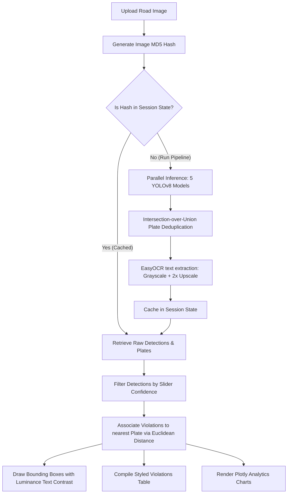

# 🚦 TrafficAI — Bengaluru Violation Detection System

> **An AI-powered, real-time traffic violation detection and enforcement system designed for Bengaluru's roads.**
> Built using 5 custom-trained parallelized YOLOv8 models, EasyOCR, and interactive analytics dashboards.

---

## 🌟 Key Features

- **Parallel Inference Engine**: Uses Python's `ThreadPoolExecutor` to run 5 YOLOv8 models concurrently, reducing processing latency.
- **Hugging Face ZeroGPU Ready**: Built-in support for HF Spaces with `@spaces.GPU` decorators, falling back to local CPU/GPU dynamically.
- **Intelligent License Plate Reader**:
  - Deduplicates overlapping bounding boxes from different models using Intersection-over-Union (IoU > 0.5).
  - Preprocesses license plate crops (RGB to Grayscale + 2x Bicubic Upscaling) to maximize OCR extraction accuracy.
- **Violation Proximity Matching**: Associates detected traffic violations with the closest vehicle license plate using Euclidean distance matching.
- **Instant Response Caching**: MD5 file-hashing caches raw detections (down to 15% confidence baseline) in `st.session_state`. Moving the confidence slider filters detections in Python instantly without re-running models.
- **Contrast-Adjusting Annotator**: Bounding boxes are drawn in designated police enforcement colors. Text label colors (black vs. white) are calculated dynamically based on background luminance to ensure readability on any background.
- **Professional Analytics Dashboard**: Interactive Plotly charts breakdown violation types and model confidence distributions.
- **Report Exporters**: Single-click downloads for annotated images (PNG), and structured violation registers (CSV and JSON).

---

## 🛠️ System Architecture



---

## 📊 Model Specifications

TrafficAI orchestrates five neural network models to inspect different traffic rules.

| Model File | Class ID | Target Class | Color Accent | Description |
| :--- | :---: | :--- | :---: | :--- |
| **`helmet.pt`** | 0 | `numberPlate` | Red | License plate bounding region |
| | 1 | `faceWithNoHelmet` | Green | **Violation**: Rider not wearing a helmet |
| | 2 | `faceWithGoodHelmet` | Blue | Rider wearing a standard safe helmet |
| | 3 | `faceWithBadHelmet` | Yellow | **Violation**: Pillion/rider wearing a damaged/unsafe helmet |
| | 4 | `rider` | Magenta | Motorcyclist/rider body bounds |
| **`plate.pt`** | 0 | `License_Plate` | Cyan | License plate bounding region (dedicated detector) |
| **`triple.pt`** | 0 | `no_helmet` | Red | **Violation**: Multi-rider helmet violation |
| | 1 | `vehicle` | White | Motorcycle/scooter body bounds |
| | 2 | `triple_riding` | Orange | **Violation**: 3 or more people riding a two-wheeler |
| | 3 | `with_helmet` | Blue | Rider wearing a helmet |
| **`seatbelt.pt`** | 0 | `person_no_seatbelt` | Red | **Violation**: Driver/passenger not wearing a seatbelt |
| | 1 | `person_seatbelt` | Blue | Occupant wearing a seatbelt |
| **`bengaluru.pt`**| 0-6 | `Truck`, `bicycle`, `bus`, `car`, `lcv`, `three-wheeler`, `two-wheeler` | White | Specific vehicle classification for Bengaluru road traffic |

---

## 📂 Project Structure

```
traffic-violation-detector/
├── app.py                      # Main entrypoint and Streamlit page layout
├── config.py                   # Styling variables, CSS templates, and violation lists
├── requirements.txt            # Python dependencies
├── README.md                   # App documentation and Hugging Face configuration
├── utils/
│   ├── __init__.py
│   ├── model_loader.py        # Cached YOLOv8 & EasyOCR model loaders
│   ├── inference.py           # Multi-threaded parallel inference runner
│   ├── ocr_processor.py       # IoU filtering, image preprocessing, and plate OCR
│   ├── annotator.py           # Drawing boxes and contrast-text on the image
│   ├── report_generator.py    # Formatting pandas reports and CSS row styling
│   └── visualizer.py          # Creating interactive Plotly charts
└── models/                     # Git LFS directory containing weight files
    ├── helmet.pt
    ├── plate.pt
    ├── triple.pt
    ├── seatbelt.pt
    └── bengaluru.pt
```

---

## 🚀 Getting Started

### 1. Prerequisities & Installation
Ensure you have Python 3.9+ installed. Clone the repository and install dependencies:
```bash
git clone https://github.com/Rajojha-1/Gridlock.git
cd traffic-violation-detector
pip install -r requirements.txt
```

### 2. Model Weights
Make sure all five weights (`.pt` files) are placed inside the `models/` directory. If you have Git LFS set up, they will download automatically during clone:
```bash
# Verify weights tracking
git lfs status
```

### 3. Launching Locally
Start the local development server:
```bash
streamlit run app.py
```
*Tip: If you want to test the dashboard, CSV downloads, or Plotly charts without running the weights, toggle the **Enable Simulation Mode** checkbox in the sidebar.*

---

## ☁️ Deploying to Hugging Face Spaces

1. Create a new Space on Hugging Face: select **Streamlit** as the SDK.
2. Link your GitHub repository or push directly to the HF remote.
3. Hugging Face ZeroGPU is fully supported. The `@spaces.GPU` decorator inside `utils/inference.py` ensures the parallel YOLO execution is assigned GPU resources on-demand.
4. If you aren't using LFS on Hugging Face, upload the `.pt` weights directly into the `models/` folder using the Space's web interface.
